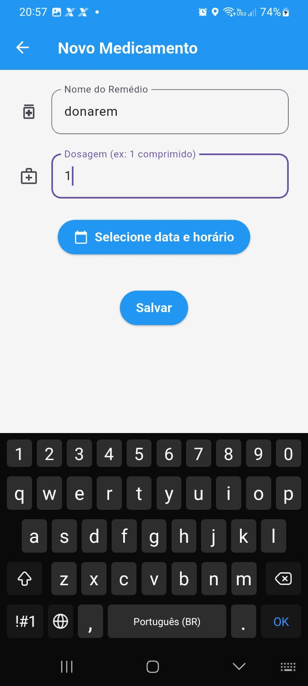
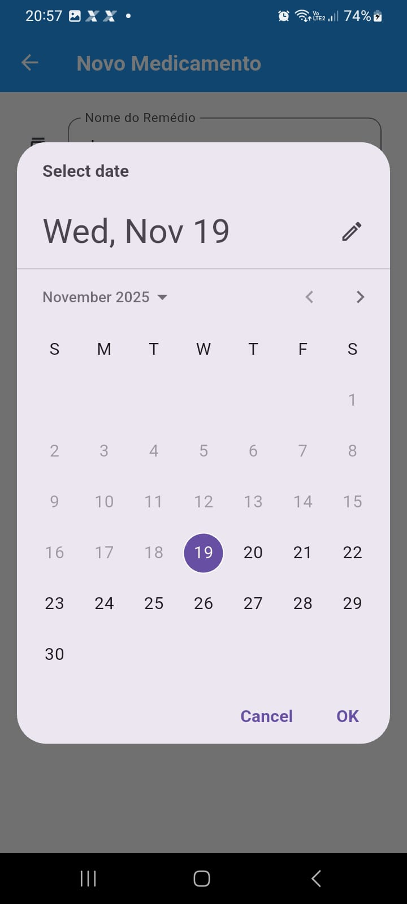
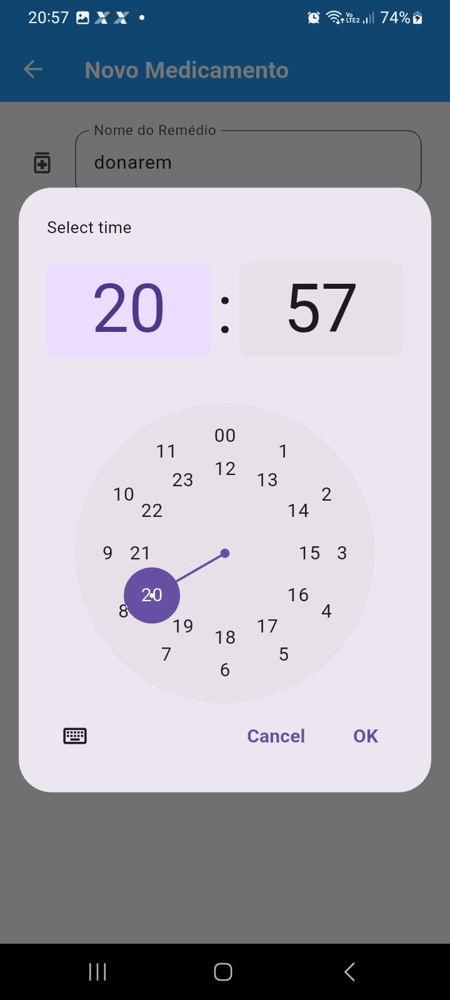

# SistematizacaoProjeto02
Programação para Dispositivos Móveis — Turma B (0925) —  GV2
Aluno: Gustavo Nascimento Pimentel e Oliveira Ra:72501593

ODS3

O problema: Esquecer de tomar remedios e metas do que precisa ser feito durante a semana
A solução: App para mandar notificação em dias determinados pelo usuario.
Publico alvo: Todo mundo que precisa se lembrar das coisas.
Objetivos: Ser um app que uma vez no fim semana você programe sobre coisas importantes para fazer durante a semana
Tipo de Aplicação: Hibrido

Instalação: Instalar o app-release.apk e rodar no celular logar como usuario anonimo e rodar o app

Requisitos: 

    Android: R Quad-core (ou melhor), com clocks acima de 1.5 GHz. 
    iOS: Qualquer dispositivo iPhone 6s ou SE (1ª Geração) ou superior (com suporte ao iOS mais recente que o app for compilado) geralmente atenderá aos requisitos mínimos de CPU do Flutter.

    Memória RAM: Mínimo Aceitável: 2 GB de RAM.
    Espaço de Armazenamento:
    Mínimo: Pelo menos 1 GB a 2 GB de espaço livre no dispositivo para acomodar o aplicativo, dados de cache e dados do usuário persistentes (como aqueles armazenados pelo Cloud Firestore).
    Versão do Sistema Operacional:
    Android: Pelo menos Android 6.0 (Marshmallow) ou Android 7.0 (Nougat). Versões mais recentes (como o Android 10+) são sempre preferíveis
    iOS:  iOS 12 ou iOS 13.

